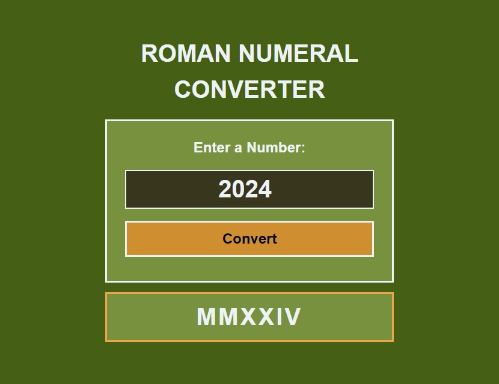

# roman-numeral-converter
freeCodeCamp JavaScript Algorithms and Data Structures Certification Project
 Roman Numeral Converter
 An application that converts integers to Roman numerals

Browse: <https://cemcelikgh.github.io/roman-numeral-converter/>

